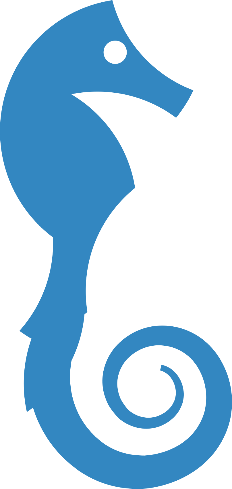

<h1 align="center">Seahorse</h1>

<a href="https://travis-ci.com/sunnytreesoftware/seahorse">

<h2 align="center">Seahorse is a Content Management System built with Laravel </h2>
 

## Installation  
Install Laravel  
`
laravel new seahorse
`  

Laravel Auth  
`
php artisan make:auth  
`

Migrations  
`
php artisan migrate  
`  

Install Seahorse
`
composer require sunnytreesoftware/seahorse
`  

Publish Assets  
`
php artisan vendor:publish --provider="Sunnytree\Seahorse\SeahorseServiceProvider"
`

Go to your-website.com/seahorse

